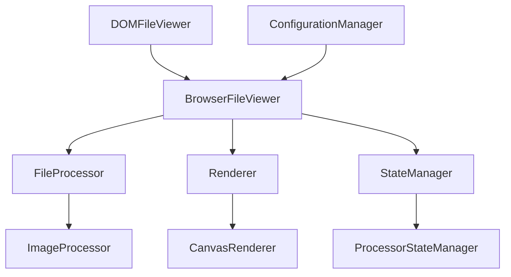

# API Overview

The Portyl API is designed to be framework-agnostic and provides a clean separation between file processing, rendering, and state management. This modular architecture allows you to use only the components you need while maintaining flexibility for custom implementations.

## Core Architecture



## Main Components

### Core Classes

- **[BrowserFileViewer](/api/browser-file-viewer)** - Main viewer class for file processing and rendering
- **[DOMFileViewer](/api/dom-file-viewer)** - DOM adapter for easy integration
- **[FileProcessor](/api/file-processor)** - Abstract base for file processing
- **[Renderer](/api/renderer)** - Abstract base for rendering implementations

### Processors

- **[ImageProcessor](/api/image-processor)** - Handles image file processing (JPEG, PNG, TIFF, etc.)

### Renderers

- **[CanvasRenderer](/api/canvas-renderer)** - Canvas-based rendering implementation

### Configuration

- **[ConfigurationManager](/api/configuration-manager)** - Runtime configuration management
- **[ViewerConfig](/api/viewer-config)** - Configuration interface
- **[RenderOptions](/api/render-options)** - Rendering options interface

### State Management

- **[StateManager](/api/state-manager)** - Generic state management
- **[ProcessorStateManager](/api/state-manager)** - Processor-specific state management

### Utilities

- **[FileUtils](/api/file-utils)** - File utility functions
- **[Types](/api/types)** - TypeScript type definitions

## Quick Start

```typescript
import { BrowserFileViewer } from 'portyl';

// Create a viewer instance
const viewer = new BrowserFileViewer({
  maxDimensions: { width: 1920, height: 1080 },
  showFileInfo: true,
  enablePagination: true
});

// Load a file
const result = await viewer.loadFile(file);
if (result.success) {
  // File loaded successfully
  console.log(`Loaded ${result.pageCount} pages`);
}

// Render to canvas
const canvas = document.getElementById('canvas') as HTMLCanvasElement;
await viewer.renderToTarget(canvas);
```

## Framework Integration

### Vanilla JavaScript

```typescript
import { DOMFileViewer } from 'portyl';

const container = document.getElementById('viewer');
const viewer = new DOMFileViewer(container);
await viewer.loadFile(file);
```

### React

```typescript
import { BrowserFileViewer } from 'portyl';
import { useEffect, useRef } from 'react';

function FileViewer({ file }) {
  const canvasRef = useRef<HTMLCanvasElement>(null);
  const viewerRef = useRef<BrowserFileViewer>();

  useEffect(() => {
    viewerRef.current = new BrowserFileViewer();
    return () => viewerRef.current?.destroy();
  }, []);

  useEffect(() => {
    if (file && viewerRef.current) {
      viewerRef.current.loadFile(file).then(result => {
        if (result.success && canvasRef.current) {
          viewerRef.current.renderToTarget(canvasRef.current);
        }
      });
    }
  }, [file]);

  return <canvas ref={canvasRef} />;
}
```

### Vue

```typescript
import { BrowserFileViewer } from 'portyl';
import { ref, onMounted, onUnmounted } from 'vue';

export default {
  setup() {
    const canvas = ref<HTMLCanvasElement>();
    let viewer: BrowserFileViewer;

    onMounted(() => {
      viewer = new BrowserFileViewer();
    });

    onUnmounted(() => {
      viewer?.destroy();
    });

    const loadFile = async (file: File) => {
      const result = await viewer.loadFile(file);
      if (result.success && canvas.value) {
        await viewer.renderToTarget(canvas.value);
      }
    };

    return { canvas, loadFile };
  }
};
```

## Key Features

### 🔄 **Framework Agnostic**
- Works with any JavaScript framework or vanilla JS
- Clean separation of concerns
- No framework-specific dependencies

### 📁 **Multi-format Support**
- Images: JPEG, PNG, GIF, WebP, SVG, BMP, TIFF
- Extensible processor system for future formats

### 🎨 **Flexible Rendering**
- Canvas-based rendering by default
- Custom renderer support
- Multiple render targets

### ⚡ **Performance Optimized**
- Lazy loading and pagination
- Memory management
- Configurable caching strategies

### 🔧 **Highly Configurable**
- Runtime configuration updates
- Preset configurations
- Validation and error handling

### 📊 **State Management**
- Immutable state patterns
- Event-driven architecture
- Time-travel debugging support

## Event System

Portyl uses a comprehensive event system for state changes and user interactions:

```typescript
viewer.addEventListener('loaded', (event) => {
  console.log('File loaded:', event.detail);
});

viewer.addEventListener('pageChanged', (event) => {
  console.log('Page changed:', event.detail);
});

viewer.addEventListener('error', (event) => {
  console.error('Error:', event.detail.error);
});
```

## TypeScript Support

Full TypeScript support with comprehensive type definitions:

```typescript
import type { 
  ViewerConfig, 
  LoadResult, 
  RenderResult, 
  FileInfo,
  ProcessorState 
} from 'portyl';
```

## Next Steps

- [BrowserFileViewer API](/api/browser-file-viewer) - Main viewer class
- [Configuration Guide](/guide/configuration) - Configuration options
- [Tutorial: Your First Viewer](/tutorial/your-first-viewer) - Step-by-step guide
