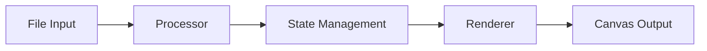

# What is Portyl?

**Portyl** is a modern, lightweight TypeScript library for rendering files in the browser through a high-performance canvas-based viewer. Built with flexibility and performance in mind, Portyl provides a complete solution for web applications, desktop apps, and cross-platform tools that need robust file viewing capabilities.

## Overview

Portyl separates file processing from rendering, giving you full control over how files are displayed in your application. Whether you're building a web-based image gallery, an Electron file manager, or a Tauri desktop application, Portyl provides the tools you need with a simple, intuitive API.

## Key Features

###  🎨 Canvas-Based Rendering

Portyl uses HTML5 Canvas for high-performance rendering, ensuring smooth display of images and files even on lower-end devices. The canvas-based approach provides:

- Hardware-accelerated rendering
- Precise control over image display
- Support for complex image formats
- Efficient memory management

### 📦 Framework Agnostic

Use Portyl with any JavaScript framework or none at all:

- **Vanilla JavaScript** - No framework required
- **React** - Hooks and components ready
- **Vue** - Composition API compatible
- **Angular** - Service-based integration
- **Svelte** - Reactive store compatible

### 🖥️ Desktop Application Ready

Perfect for desktop applications that need to display local files from the file system:

- **Electron** - Full Node.js integration
- **Tauri** - Rust-powered performance
- **NW.js** - Direct filesystem access
- **Neutralino** - Lightweight alternative

### 🏗️ Extensible Architecture

Built with extension in mind:

- **Custom Processors** - Add support for new file types
- **Custom Renderers** - Implement alternative rendering strategies
- **Plugin System** - Extend functionality as needed
- **Event System** - React to file processing events

### 📘 TypeScript First

Written in TypeScript with comprehensive type definitions:

- Full IntelliSense support
- Type-safe APIs
- Excellent IDE integration
- Runtime type validation

## Architecture

Portyl is built around three core concepts:

1. **Processors** - Handle file loading and data extraction
2. **State Management** - Track file state and pagination
3. **Renderers** - Transform processed data into visual output

This separation of concerns means you can:

- Process files without rendering them
- Render the same file with different renderers
- Extend any part of the pipeline independently

## Browser Support

Portyl works in all modern browsers:

- Chrome 60+
- Firefox 55+
- Safari 12+
- Edge 79+

## Use Cases

### Web Applications

- **Image Galleries** - Display collections of images
- **File Previews** - Preview files before upload
- **Content Management** - Integrate into CMS systems
- **Document Viewers** - View documents in the browser

### Desktop Applications

- **File Managers** - Built-in file preview
- **Image Viewers** - Standalone image viewing apps
- **Asset Browsers** - Game development tools
- **Photo Organizers** - Photo management software

### Cross-Platform Tools

- **Design Tools** - Preview assets and images
- **Development Tools** - View generated files
- **Testing Tools** - Visual regression testing
- **Documentation Systems** - Embed file viewers

## What Makes Portyl Different?

### Separation of Concerns

Unlike monolithic file viewers, Portyl separates file processing from rendering. This means:

- Process files once, render multiple times
- Swap renderers without reprocessing
- Test processing logic independently

### Multi-Page Support

Built-in support for multi-page files like TIFF:

- Page navigation API
- Preload next/previous pages
- Jump to specific pages
- Custom pagination UI

### Event-Driven

React to file processing events:

- Loading progress
- Page changes
- Processing complete
- Error handling

### Memory Efficient

Optimized for handling large files:

- Lazy loading of pages
- Automatic cleanup
- Configurable preloading
- Memory usage monitoring

## Next Steps

Ready to get started?

- [**Getting Started**](/guide/getting-started) - Set up your first viewer in 5 minutes
- [**Installation**](/guide/installation) - Install Portyl in your project
- [**Tutorial**](/tutorial/your-first-viewer) - Build your first file viewer
- [**Core Concepts**](/guide/core-concepts) - Understand how Portyl works

## Community

- [GitHub](https://github.com/ricardoferreirades/portyl) - Source code and issues
- [NPM](https://www.npmjs.com/package/portyl) - Package downloads
- [Examples](https://ricardoferreirades.github.io/portyl/) - Live demos

## License

Portyl is [MIT licensed](https://github.com/ricardoferreirades/portyl/blob/main/LICENSE).

